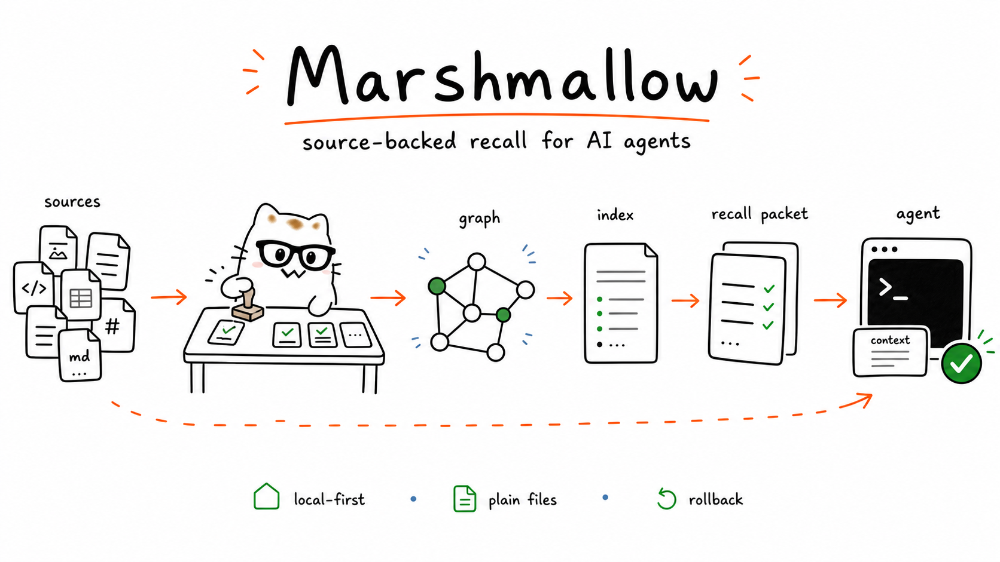

<div align="center">



# Marshmallow

### Source-backed recall for AI agents.

**A local context runtime for agent work.** Marshmallow turns the things you
explicitly provide — people, projects, decisions, corrections, examples, formats,
and working rules — into plain-file context your agents can recall before they
act.

[](https://github.com/notmehul/marshmallow/actions/workflows/test.yml)
[](LICENSE)
[](#supported-harnesses)

</div>

---

## Why this exists

Agents are useful, but they miss the context that makes work correct.

They may know the task and still miss the person, project, relationship,
decision, or format behind it.

Marshmallow gives them source-backed recall: the few entities, decisions,
working rules, and open loops that matter now.

It keeps a small, source-backed graph of the things you explicitly ask it to
learn, then routes that graph into compact indexes, task-shaped recall packets,
runtime guidance, and optional skill overlays.

> **Marshy** is the mascot. Marshmallow is the system.
> Cute face, boringly inspectable files underneath.

## The idea

```text
sources -> typed graph nodes -> indexes/recall packets -> runtime.md -> adapter -> agent
```

- **Sources** are things you chose: files, notes, examples, rejected outputs,
  corrections, screenshots, PDFs, or URLs.
- **Graph nodes** are compact, source-backed records: entities, decisions,
  relationships, preferences, and working rules.
- **Indexes** are agent-written navigation pages that keep future agents from
  crawling the whole graph.
- **Projections** are task-shaped recall packets for meetings, handoffs,
  workflows, or focused agent work.
- **`runtime.md`** tells the agent to check indexes first, then load only the
  graph nodes and projections that matter now.
- **Adapters** connect that runtime file to `CLAUDE.md` or `AGENTS.md`.
- **Skill overlays** are optional downstream tuning for existing agent skills.

The goal is not to make a giant memory layer. The goal is to give connected
agents the right source-backed context before they draft, decide, or act.

## Trust model

Marshmallow is deliberately boring where trust matters.

- **Local-first.** It writes plain files under `~/.marshmallow/`.
- **Explicit learning.** No background capture. No silent session ingestion.
- **Source-backed guidance.** Graph nodes point back to real sources or approved
  corrections.
- **Preview before mutation.** Adapter installs and skill rewrites show you what
  will change.
- **Rollback.** Applied mutations create byte-exact backups and rollback records.

No hosted profile. No dashboard. No database. No memory daemon.

## Quickstart

### Claude Code

```text
/plugin marketplace add notmehul/marshmallow
/plugin install marshmallow
```

> Prefer the CLI? `claude plugin marketplace add notmehul/marshmallow && claude plugin install marshmallow`

Then start the calibration:

```text
/marshmallow:start
```

Marshy asks for a small context pack: people, projects, decisions, formats,
corrections, rejected outputs, or working rules. Marshmallow turns that bundle
into the first source-backed graph, previews the runtime adapter, and can propose
optional skill overlays when they are useful.

Nothing durable is written without your explicit approval.

Later, teach it more with `/marshmallow:learn`, find context with `recall`, and
retune skills with `/marshmallow:tune` when a reusable skill should change.

### Codex & Cursor

Marshmallow's graph and recall packets are plain files. Codex and Cursor can
read the same context through an `AGENTS.md` adapter:

```bash
scripts/marshmallow.py init
scripts/marshmallow.py adapter preview --harness codex   # ~/.codex/AGENTS.md
scripts/marshmallow.py adapter apply --harness codex

scripts/marshmallow.py adapter preview --harness cursor  # ./AGENTS.md
scripts/marshmallow.py adapter apply --harness cursor
```

## What it creates

`~/.marshmallow/` is the source of truth — plain files, no database:

```text
runtime.md    # short instructions imported by CLAUDE.md / AGENTS.md
inbox/        # unsynthesized candidate material (untrusted until promoted)
sources/      # source cards with pointers and provenance
graph/        # source-backed context nodes (the durable substrate)
indexes/      # compact navigation pages for agents
projections/  # task-shaped recall packets
overlays/     # approved skill alignment overlays
backups/      # exact backup bytes plus record.json for rollback
```

## Skills

- **`/marshmallow:start`** — onboard the workspace, build the first recall
  graph, install the runtime adapter, and optionally create the first tune.
- **`/marshmallow:learn`** — ingest explicit sources, corrections, decisions, or
  context updates.
- **`/marshmallow:tune`** — optionally retune skills with overlays, create
  aligned copies or starter skills, and roll overlays back.

## CLI

The skills call one public CLI. You can run it directly too:

```bash
scripts/marshmallow.py init
scripts/marshmallow.py doctor
scripts/marshmallow.py scan-skills
scripts/marshmallow.py recall "<query>" [--json] [--limit N]
scripts/marshmallow.py adapter preview   [--harness claude|codex|cursor]
scripts/marshmallow.py adapter apply     [--harness claude|codex|cursor]
scripts/marshmallow.py adapter remove [--approve]
scripts/marshmallow.py overlay preview  --skill <SKILL.md> --overlay <overlay.md>
scripts/marshmallow.py overlay apply    --skill <SKILL.md> --overlay <overlay.md>
scripts/marshmallow.py overlay rollback --skill <SKILL.md> [--approve]
scripts/marshmallow.py starter preview  --overlay <overlay.md>
scripts/marshmallow.py starter apply    --overlay <overlay.md>
```

Preview before mutation. Adapter installs and skill rewrites require explicit
approval. Rollback metadata lives beside each backup in `backups/`.

## Graph shape

Graph node minimum schema:

```yaml
id: prefer-clear-hierarchy
insight: Prefer clear hierarchy over decorative complexity.
source_ids: [source-example]
applies_to: [design]
related_nodes: []
skills: [frontend-design]
labels: [investor-update]
type: decision
subjects: [marshmallow, fundraising]
status: active
updated: 2026-06-01
```

Graph nodes should stay compact and behavior-changing. Use the body to explain
the record, evidence, affected behavior, limits, and any real `[[wikilink]]`
connections. `doctor --json` may report quality warnings for generic or thin
nodes; warnings do not break existing workspaces. Optional typed fields such as
`type`, `subjects`, `status`, and `updated` help agents navigate the graph.
Beta types are `entity`, `decision`, `relationship`, and `preference`, but they
are retrieval hints rather than a fixed taxonomy.

Indexes and projections are Markdown runtime aids. Projections are task-shaped
recall packets. Agents may write them, and `doctor` validates their frontmatter
and graph references, but durable source truth stays in `sources/` and `graph/`.

Source card minimum schema:

```yaml
id: source-example
pointer: /absolute/path/or/url
captured: 2026-06-01T00:00:00Z
summary: Optional reason this source matters.
labels: [product]
```

Every graph node must have at least one `source_ids` entry. User corrections are
saved as source cards, so corrections stay source-backed too.

## Supported harnesses

| Harness | Adapter target | Style |
| --- | --- | --- |
| Claude Code | `~/.claude/CLAUDE.md` | native `@import` |
| Codex | `~/.codex/AGENTS.md` | pointer block |
| Cursor | `./AGENTS.md` | pointer block |

The full onboarding skills are built for Claude Code today. Codex and Cursor
read the same graph and recall packets through the `AGENTS.md` adapter; deeper
native flows for them are on the roadmap.

## Try the demo

The bundled demo workspace is reproducible and touches nothing real:

```bash
scripts/marshmallow.py doctor --workspace examples/operator-recall
```

See [DEMO.md](DEMO.md) for the recall-first walkthrough and optional skill
overlay demo.

## Checks

```bash
python3 -m unittest discover -s tests -v
python3 -m compileall -q scripts tests
claude plugin validate . --strict
```

Requires **Python 3.9+** and the Claude Code CLI for plugin validation.

## Learn more

- [ARCHITECTURE.md](ARCHITECTURE.md) — the runtime loop and design boundaries
- [METHODOLOGY.md](METHODOLOGY.md) — what we borrowed, what we deliberately didn't
- [docs/trust-and-rollback.md](docs/trust-and-rollback.md) — the trust model
- [UX.md](UX.md) — what good onboarding should feel like
- [CONTRIBUTING.md](CONTRIBUTING.md) — how to help

## Contributing

Marshmallow is built for builders — try it, remix it, make it yours. Issues and
PRs welcome. See [CONTRIBUTING.md](CONTRIBUTING.md).

## License

[MIT](LICENSE).
