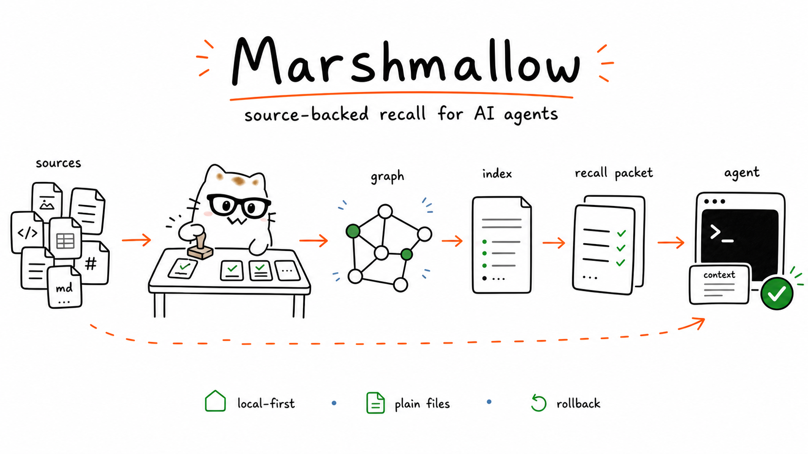

<div align="center">



# Marshmallow

### Source-backed recall for AI agents.

**A local context runtime for agent work.** Marshmallow turns the things you
explicitly provide — people, projects, decisions, corrections, examples, formats,
and working rules — into plain-file context your agents can recall before they
act.

[](https://github.com/notmehul/marshmallow/actions/workflows/test.yml)
[](LICENSE)
[](#supported-harnesses)

</div>

---

## Why this exists

Agents are useful, but they miss the context that makes work correct.

They may know the task and still miss the person, project, relationship,
decision, or format behind it.

Marshmallow gives them source-backed recall: the few entities, decisions,
working rules, and open loops that matter now.

It keeps a small, source-backed graph of the things you explicitly ask it to
learn, then routes that graph into compact indexes, task-shaped recall packets,
runtime guidance, and optional skill overlays.

> **Marshy** is the mascot. Marshmallow is the system.
> Cute face, boringly inspectable files underneath.

## The idea

```text
sources -> typed graph nodes -> indexes/recall packets -> runtime.md -> adapter -> agent
```

- **Sources** are things you chose: files, notes, examples, rejected outputs,
  corrections, screenshots, PDFs, or URLs.
- **Graph nodes** are compact, source-backed records: entities, decisions,
  relationships, preferences, and working rules.
- **Indexes** are agent-written navigation pages that keep future agents from
  crawling the whole graph.
- **Projections** are task-shaped recall packets for meetings, handoffs,
  workflows, or focused agent work.
- **`runtime.md`** tells the agent to check indexes first, then load only the
  graph nodes and projections that matter now.
- **Adapters** connect that runtime file to `CLAUDE.md` or `AGENTS.md`.
- **Skill overlays** are optional downstream tuning for existing agent skills.

The goal is not to make a giant memory layer. The goal is to give connected
agents the right source-backed context before they draft, decide, or act.

## Trust model

Marshmallow is deliberately boring where trust matters.

- **Local-first.** It writes plain files under `~/.marshmallow/`.
- **Explicit learning.** No background capture. No silent session ingestion.
- **Source-backed guidance.** Graph nodes point back to real sources or approved
  corrections.
- **Preview before mutation.** Adapter installs and skill rewrites show you what
  will change.
- **Rollback.** Applied mutations create byte-exact backups and rollback records.

No hosted profile. No dashboard. No database. No memory daemon.

## Quickstart

### Claude Code

```text
/plugin marketplace add notmehul/marshmallow
/plugin install marshmallow
```

> Prefer the CLI? `claude plugin marketplace add notmehul/marshmallow && claude plugin install marshmallow`

Then start the calibration:

```text
/marshmallow:start
```

Marshy asks for a small context pack: people, projects, decisions, formats,
corrections, rejected outputs, or working rules. Marshmallow turns that bundle
into the first source-backed graph, previews the runtime adapter, and can propose
optional skill overlays when they are useful.

Nothing durable is written without your explicit approval.

Later, teach it more with `/marshmallow:learn`, find context with `recall`, and
retune skills with `/marshmallow:tune` when a reusable skill should change.

### Codex & Cursor

Marshmallow's graph and recall packets are plain files. Codex and Cursor can
read the same context through an `AGENTS.md` adapter.

For Codex:

```bash
scripts/marshmallow.py setup --harness codex
scripts/marshmallow.py setup --harness codex --apply
```

For Cursor, run this from the project you want Cursor to read:

```bash
scripts/marshmallow.py setup --harness cursor
scripts/marshmallow.py setup --harness cursor --apply
```

`setup` creates or verifies `~/.marshmallow/`, previews the adapter, and only
writes the `AGENTS.md` block when you pass `--apply`. Prefer the lower-level
commands when you want to inspect each step separately:

```bash
scripts/marshmallow.py init
scripts/marshmallow.py adapter preview --harness codex   # ~/.codex/AGENTS.md
scripts/marshmallow.py adapter apply --harness codex

scripts/marshmallow.py adapter preview --harness cursor  # ./AGENTS.md
scripts/marshmallow.py adapter apply --harness cursor
```

## What it creates

`~/.marshmallow/` is the source of truth — plain files, no database:

```text
runtime.md    # short instructions imported by CLAUDE.md / AGENTS.md
inbox/        # active untrusted candidates; terminal items move to archive/
sources/      # source cards with pointers and provenance
graph/        # source-backed context nodes (the durable substrate)
indexes/      # compact navigation pages for agents
projections/  # task-shaped recall packets
overlays/     # approved skill alignment overlays
backups/      # exact backup bytes plus record.json for rollback
```

## Skills

- **`/marshmallow:start`** — onboard the workspace, build the first recall
  graph, install the runtime adapter, and optionally create the first tune.
- **`/marshmallow:learn`** — ingest explicit sources, corrections, decisions, or
  context updates.
- **`/marshmallow:tune`** — optionally retune skills with overlays, create
  aligned copies or starter skills, and roll overlays back.

## CLI

The skills call one public CLI. You can run it directly too:

```bash
scripts/marshmallow.py init
scripts/marshmallow.py setup --harness codex|cursor [--apply]
scripts/marshmallow.py new source|node|index|projection|overlay <id> [--title ...] [--task ...] [--force]
scripts/marshmallow.py doctor
scripts/marshmallow.py scan-skills
scripts/marshmallow.py recall "<query>" [--json] [--limit N]
scripts/marshmallow.py remember "<note>" [--why ...] [--origin ...]
scripts/marshmallow.py pending [--all] [--limit N] [--json]
scripts/marshmallow.py promote <candidate-id> [--apply] [--json]
scripts/marshmallow.py dismiss <candidate-id> [--reason ...] [--apply] [--json]
scripts/marshmallow.py adapter preview   [--harness claude|codex|cursor]
scripts/marshmallow.py adapter apply     [--harness claude|codex|cursor]
scripts/marshmallow.py adapter remove [--approve]
scripts/marshmallow.py overlay preview  --skill <SKILL.md> --overlay <overlay.md>
scripts/marshmallow.py overlay apply    --skill <SKILL.md> --overlay <overlay.md>
scripts/marshmallow.py overlay rollback --skill <SKILL.md> [--approve]
scripts/marshmallow.py starter preview  --overlay <overlay.md>
scripts/marshmallow.py starter apply    --overlay <overlay.md>
```

Preview before mutation. Adapter installs and skill rewrites require explicit
approval. Rollback metadata lives beside each backup in `backups/`.

## The loop: capture, promote, recall

Marshmallow keeps capture frictionless and durability earned. The trust gate
sits at *promotion*, not capture, so any model can store freely without ever
touching the graph.

- **`remember`** drops a note into `inbox/` as an untrusted candidate. No
  approval, no graph change — the inbox is untrusted by construction. Agents
  use it for unmistakable feedback, not generic praise or temporary directions,
  and tell you briefly when they capture something.
- **`pending`** lists a bounded batch awaiting review.
- **`promote`** turns a reviewed candidate into a source card — the provenance
  anchor. You (or the agent) then write the graph node that cites it with
  `new node`, keeping the synthesis judgment human. Preview unless `--apply`;
  the terminal candidate moves to `inbox/archive/`.
- **`dismiss`** archives a low-signal or redundant candidate without changing
  sources or graph. It also previews unless `--apply`.
- **`recall`** returns matching graph nodes with their resolved source
  citations attached, so every recalled fact traces back to an immutable
  source. Unresolved provenance is flagged, never hidden.

This is the deliberate boundary: an agent's own note can become a first-class,
citable source, but nothing reaches the durable graph without a source behind
it. No background daemon, no silent ingestion into trusted memory.

## MCP server

So any model reaches for Marshmallow without a runtime ritual, the loop is also
exposed as a dependency-free stdio MCP server (`scripts/mcp_server.py`). The tool
descriptions are the instructions — a non-Claude harness gets "recall before you
act, capture instead of forgetting" with no extra wiring.

It exposes three **safe** tools:

- **`recall`** — read source-backed context with citations (read-only).
- **`remember`** — capture into the untrusted inbox (never touches the graph).
- **`pending`** — list candidates awaiting review (read-only).

`promote` is deliberately **not** exposed. Crossing a candidate into the trusted
graph is the human gate; an autonomous model must not bypass it. Promotion stays
a deliberate act through the CLI or `/marshmallow:learn`.

In Claude Code the server is auto-registered when you install the plugin. For
other harnesses, clone the repository, run the following commands from its root,
and restart or reload the harness:

```bash
# Codex (user-wide; shared by the CLI and IDE extension)
codex mcp add marshmallow -- "$PWD/scripts/mcp_server.py"

# Cursor (the app asks you to confirm the new server)
cursor --add-mcp "{\"name\":\"marshmallow\",\"command\":\"$PWD/scripts/mcp_server.py\"}"

# Gemini CLI (user-wide)
gemini mcp add --scope user marshmallow "$PWD/scripts/mcp_server.py"
```

OpenCode uses a local-server entry in `opencode.json`:

```json
{
  "$schema": "https://opencode.ai/config.json",
  "mcp": {
    "marshmallow": {
      "type": "local",
      "command": ["/absolute/path/to/marshmallow/scripts/mcp_server.py"],
      "enabled": true
    }
  }
}
```

Other stdio MCP clients can use the same executable path as their `command`.
On first start, the server creates the plain-file workspace skeleton under
`~/.marshmallow/`. Through MCP, subsequent content is written only by an
explicit `remember` tool call, and it goes solely to the untrusted inbox.

## Graph shape

Graph node minimum schema:

```yaml
id: prefer-clear-hierarchy
insight: Prefer clear hierarchy over decorative complexity.
source_ids: [source-example]
applies_to: [design]
related_nodes: []
skills: [frontend-design]
labels: [investor-update]
type: decision
subjects: [marshmallow, fundraising]
status: active
updated: 2026-06-01
```

Graph nodes should stay compact and behavior-changing. Use the body to explain
the record, evidence, affected behavior, limits, and any real `[[wikilink]]`
connections. `doctor --json` may report quality warnings for generic or thin
nodes; warnings do not break existing workspaces. Optional typed fields such as
`type`, `subjects`, `status`, and `updated` help agents navigate the graph.
Beta types are `entity`, `decision`, `relationship`, and `preference`, but they
are retrieval hints rather than a fixed taxonomy.

Indexes and projections are Markdown runtime aids. Projections are task-shaped
recall packets. Agents may write them, and `doctor` validates their frontmatter
and graph references, but durable source truth stays in `sources/` and `graph/`.

Authoring: run `marshmallow.py new <kind> <id>` to scaffold a valid, lint-aware
skeleton with every required field instead of hand-writing frontmatter, then
fill in the `TODO` placeholders. `doctor` reports every problem across the
workspace in a single pass — one malformed file no longer hides the rest.

Source card minimum schema:

```yaml
id: source-example
pointer: /absolute/path/or/url
captured: 2026-06-01T00:00:00Z
summary: Optional reason this source matters.
labels: [product]
```

Every graph node must have at least one `source_ids` entry. User corrections are
saved as source cards, so corrections stay source-backed too.

## Supported harnesses

| Harness | Runtime guidance | MCP registration |
| --- | --- | --- |
| Claude Code | `~/.claude/CLAUDE.md` native `@import` | automatic with the plugin |
| Codex | `~/.codex/AGENTS.md` pointer block | `codex mcp add` |
| Cursor | `./AGENTS.md` pointer block | `cursor --add-mcp` |
| Gemini CLI | MCP tool descriptions | `gemini mcp add` |
| OpenCode | MCP tool descriptions | local entry in `opencode.json` |

The full onboarding skills are built for Claude Code today. Codex and Cursor
can also read the graph and recall packets directly through an `AGENTS.md`
adapter. Gemini CLI and OpenCode use the MCP tool surface without an adapter.

## Try the demos

The bundled demo workspaces are reproducible and touch nothing real:

```bash
scripts/marshmallow.py doctor --workspace examples/operator-recall
scripts/marshmallow.py doctor --workspace examples/relationship-intelligence
```

See [DEMO.md](DEMO.md) for recall-first walkthroughs, including a dummy
people-first pre-meeting relationship brief.

## Checks

```bash
python3 -m unittest discover -s tests -v
python3 -m compileall -q scripts tests
claude plugin validate . --strict
```

Requires **Python 3.9+** and the Claude Code CLI for plugin validation.

## Benchmarks

Marshmallow ships its own retrieval eval and publishes the raw report behind
every number it quotes. The aim is not a leaderboard. It is to know, with
numbers, where lexical recall over a small curated graph holds and where it
stops, and to measure every change to `recall.py` against that.

How it is built:

- A pinned 100-node synthetic workspace (one fictional operator, eight weeks,
  40 raw artifacts, 40 source cards) with 40 labeled queries, each with a
  paraphrase variant, and 10 negatives. Labels were audited adversarially
  against the raw material before pinning.
- Deterministic scoring, no LLM judge. The guarded headline is exact
  answer-node hits in the top 5. Fact-alias containment is reported only as a
  diagnostic, because on this corpus a random five-node draw scores about 0.5
  on it.
- A seeded random row and a stdlib BM25 row in every table, so a number is
  always read against its floor and against the reference lexical retriever.
- Scaled 200/1000/5000-node tiers regenerate byte-identically from the seed.
- CI runs the seed tier against a pinned baseline on every push. A ranking
  change, better or worse, trips it and has to be re-pinned on purpose.

Paraphrase node MRR at top-5 (the query is reworded to share few tokens with
its answer node; this is the number that separates retrievers):

| nodes | `recall.py` | BM25 | bge-small, local | gemini-embedding-001 | random |
| ----- | ----------- | ---- | ---------------- | -------------------- | ------ |
| 100   | 0.63        | 0.82 | 0.61             | 0.83                 | 0.07   |
| 1000  | 0.20        | 0.48 | 0.32             | 0.49                 | 0.00   |

Hosted memory tools on the same seed, each ingesting the raw artifacts, scored
by fact recall inside a 1500-token context budget (direct / paraphrase):

| tool | direct | paraphrase |
| ---- | ------ | ---------- |
| gemini-embedding-001 over graph nodes | 1.000 | 0.988 |
| BM25 over graph nodes | 0.988 | 0.938 |
| GBrain 0.47, Gemini expansion | 0.938 | 0.925 |
| BM25 over raw artifacts | 0.975 | 0.925 |
| Mem0 2.0 OSS, Gemini extraction | 0.938 | 0.887 |
| Marshmallow `recall.py` | 0.988 | 0.850 |
| random | 0.287 | 0.375 |

What we conclude, and what we do not:

- `recall.py` loses to plain BM25 on paraphrase at every size, and only a
  strong hosted embedder holds up at 1000 nodes. That is the evidence behind
  the next change to recall, and the guard that will measure it.
- This seed cannot rank tools. Every non-random row sits within six queries
  of every other. We do not claim Marshmallow retrieves better than Mem0 or
  GBrain, and the data does not support the reverse either.
- Known limits, stated so nobody has to discover them: 40 queries and no
  confidence intervals; graph nodes were generated from the same fact table as
  the labels, so direct-phrasing scores are an upper bound; the scorer cannot
  tell a superseded fact from its correction; MemMachine is not yet run.

Method, full tables, and per-query reports:
[`evals/retrieval-quality/README.md`](evals/retrieval-quality/README.md) and
[`evals/retrieval-quality/reports/2026-08-29/`](evals/retrieval-quality/reports/2026-08-29/).

## Learn more

- [ARCHITECTURE.md](ARCHITECTURE.md) — the runtime loop and design boundaries
- [METHODOLOGY.md](METHODOLOGY.md) — what we borrowed, what we deliberately didn't
- [docs/trust-and-rollback.md](docs/trust-and-rollback.md) — the trust model
- [UX.md](UX.md) — what good onboarding should feel like
- [CONTRIBUTING.md](CONTRIBUTING.md) — how to help
- [Agent authoring A/B](evals/agent-authoring/README.md) — compare scaffolded and direct memory authoring

## Contributing

Marshmallow is built for builders — try it, remix it, make it yours. Issues and
PRs welcome. See [CONTRIBUTING.md](CONTRIBUTING.md).

## License

[MIT](LICENSE).
