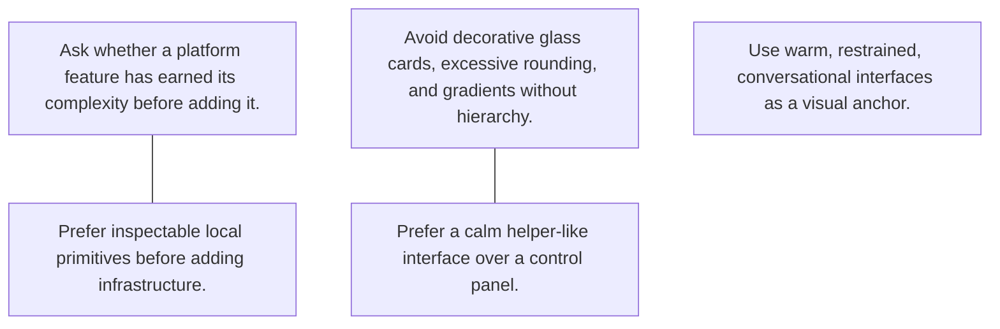

# Marshmallow Personal Skill Graph

Generated from source-backed alignment insights. Edit canonical nodes under `graph/`, then render again.

## Nodes

| Node | Labels | Insight | Sources | Skills |
| --- | --- | --- | --- | --- |
| [ask-before-platform](graph/ask-before-platform.md) | `complexity-boundary` | Ask whether a platform feature has earned its complexity before adding it. | `made-local-first-tool` | `architecture-review`, `product-spec` |
| [avoid-decorative-glass](graph/avoid-decorative-glass.md) | `visual-taste` | Avoid decorative glass cards, excessive rounding, and gradients without hierarchy. | `reject-glass-dashboard` | `frontend-design` |
| [helper-not-dashboard](graph/helper-not-dashboard.md) | `interface-character` | Prefer a calm helper-like interface over a control panel. | `like-warm-interface` | `frontend-design`, `product-spec` |
| [prefer-inspectable-systems](graph/prefer-inspectable-systems.md) | `architecture-default` | Prefer inspectable local primitives before adding infrastructure. | `made-local-first-tool` | `architecture-review` |
| [warm-interface-reference](graph/warm-interface-reference.md) | `visual-reference` | Use warm, restrained, conversational interfaces as a visual anchor. | `like-warm-interface` | `frontend-design` |
